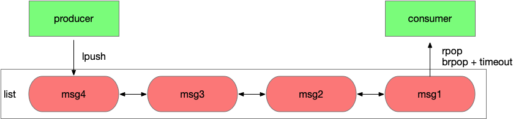
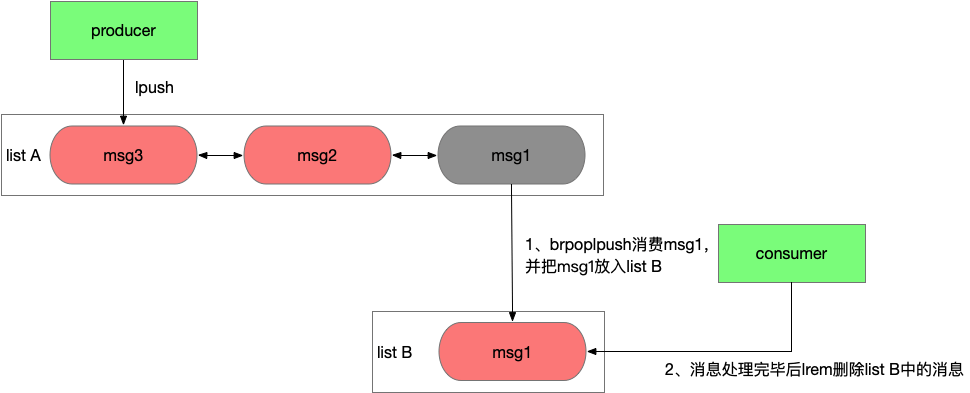
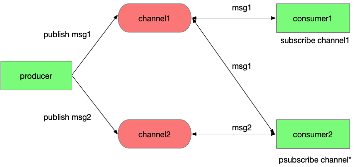
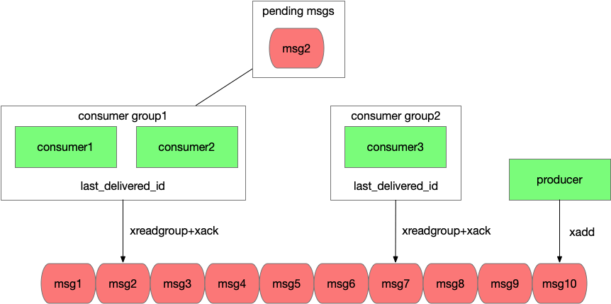

#### Redis消息队列

##### 1 Redis 1.0 list

###### 1 特征

Redis 1.0发布时就具备了list数据结构，应用A可以通过lpush写入消息，应用B通过rpop从队列中读取消息，每个消息只会被读取一次，而且是按照lpush写入的顺序读到。同时Redis的接口是并发安全的，可以同时有多个生产者向一个list中生产消息，多个消费者从list中读取消息。

**问题**：消费者要如何知道list中有消息了，需要不断轮询去查询吗。轮询无法保证消息被及时的处理，会增加延时，而且当list为空时，大部分轮询的请求都是无效请求，这种方式大量浪费了系统资源。

**方案**：好在Redis有brpop接口，该接口有一个参数是超时时间，如果list为空，那么Redis服务端不会立刻返回结果，它会等待list中有新数据后在返回或是等待最多一个超时时间后返回空。通过brpop接口实现了长轮询，该效果等同于服务端推送，消费者能立刻感知到新的消息，而且通过设置合理的超时时间，使系统资源的消耗降到很低。

###### 2 基于list完成消息的生产和消费


使用rpop或brpop这样接口消费消息会先从队列中删除消息，然后再由应用消费，如果应用应用在处理消息前异常宕机了，**消息就丢失了**。

1: 但如果使用lindex这样的只读命令先读取消息处理完毕后在删除，又需要**额外的机制**来保证一条消息不会被其他消费者重复读到。
2: 好在list有**rpoplpush或brpoplpush**这样的接口，可以原子性的从一个list中移除一个消息并加入另一个list。
应用程序可以通过2个list组和来完成消息的消费和确认功能，使用rpoplpush从list A中消费消息并移入list B，等消息处理完毕后在从list B中删除消息，如果在处理消息过程中应用异常宕机，恢复后应用可以重新从list B中读取未处理的消息并处理。这种方式为消息的消费增加了ack机制。



通过Redis 1.0就引入的list结构我们就能实现一个分布式的消息队列，满足一些简单的业务需求。但list结构作为消息队列服务有一个很致命的问题，它没有广播功能，一个消息只能被消费一次。

###### 3 总结

优势

- 模型简单，和使用本地list基本相同，适配容易
- 通过brpop做到消息处理的实时性
- 通过rpoplpush来联动2个list，可以做到消息先消费后确认，避免消费者应用异常情况下消息丢失

不足

- 消息只能被消费一次，缺乏广播机制

##### 2 Redis 2.0 pubsub

list作为消息队列应用场景受到限制很重要的原因在于没有广播，所以Redis 2.0中引入了一个新的数据结构pubsub。pubsub虽然不能算作是list的替代品，但它确实能解决一些list不能解决的问题。

###### **1 pubsub特性**

pubsub引入一个概念叫channel，生产者通过publish接口投递消息时会指定channel，消费者通过subscribe接口订阅它关心的channel，调用subscribe后这条连接会进入一个特殊的状态，通常不能在发送其他请求，当有消息投递到这个channel时Redis服务端会立刻通过该连接将消息推送到消费者。这里一个channel可以被多个应用订阅，消息会同时投递到每个订阅者，做到了消息的广播。

另一方面，消费者可以会订阅一批channel，例如一个用户订阅了浙江的新闻的推送，但浙江新闻还会进行细分，例如“浙江杭州xx”、“浙江温州xx”，这里订阅者不需要获取浙江的所有子类在挨个订阅，只需要调用psubscribe“浙江*”就能订阅所有以浙江开头的新闻推送了，这里psubscribe传入一个通配符表达的channel，Redis服务端按照规则推送所有匹配channel的消息给对应的客户端。

**基于pubsub完成channel的匹配和消息的广播**

#消费者1订阅channel1 

```shell
subscribe channel1
```

#生产者发布消息msg

```shell
publish channel1 msg1
```



在Redfis 2.8时加入了keyspace notifications功能，此时pubsub除了通知用户自定义消息，也可以通知系统内部消息。keyspace notifications引入了2个特殊的channel分别是__keyevent@__:和__keyspace@__:，通过订阅__keyevent客户端可以收到某个具体命令调用的回调通知，通过订阅__keyspace客户端可以收到目标key的增删改操作以及过期事件。使用这个功能还需要开启配置notify-keyspace-events。

#通过keyspace notifications功能获取系统事件

\#写入请求

```shell
set testkey v EX 1
```

\#订阅key级别的事件

```shell
psubscribe __keyspace@0__:testkey
```

###### **2 pubsub的不足之处**

pubsub既能单播又能广播，还支持channel的简单正则匹配，功能上已经能满足大部分业务的需求，而且这个接口发布的时间很早，在2011年Redis 2.0发布时就已经具备，用户基础很广泛，所以现在很多业务都有用到这个功能。但你要深入了解pubsub的原理后，是肯定不敢把它作为一个一致性要求较高，数据量较大系统的消息服务的。

首先，pubsub的消息数据是瞬时的，它在Redis服务端不做保存，publish发送到Redis的消息会立刻推送到所有当时subscribe连接的客户端，如果当时客户端因为网络问题断连，那么就会错过这条消息，当客户端重连后，它没法重新获取之前那条消息，甚至无法判断是否有消息丢失。

其次，pubsub中消费者获取消息是一个推送模型，这意味着Redis会按消息生产的速度给所有的消费者推送消息，不管消费者处理能力如何，如果消费者应用处理能力不足，消息就会在Redis的client buf中堆积，当堆积数据超过一个阈值后会断开这条连接，这意味着这些消息全部丢失了，在也找不回来了。如果同时有多个消费者的client buf堆积数据但又还没达到断开连接的阈值，那么Redis服务端的内存会膨胀，进程可能因为oom而被杀掉，这导致了整个服务中断。

###### **3 总结**

优势

- 消息具备广播能力
- psubscribe能按字符串通配符匹配，给予了业务逻辑的灵活性
- 能订阅特定key或特定命令的系统消息

不足

- Redis异常、客户端断连都会导致消息丢失
- 消息缺乏堆积能力，不能削峰填谷。推送的方式缺乏背压机制，没有考虑消费者处理能力，推送的消息超过消费者处理能力后可能导致消息丢失或服务异常

##### 3 Redis 5.0 stream

消息丢失、消息服务不稳定的问题严重限制了pubsub的应用场景，所以Redis需要重新设计一套机制，来解决这些问题，这就有了后来的stream结构。

###### **1 stream特性**

一个稳定的消息服务需要具备几个要点，要保证消息不会丢失，至少被消费一次，要具备削峰填谷的能力，来匹配生产者和消费者吞吐的差异。在2018年Redis 5.0加入了stream结构，这次考虑了list、pubsub在应用场景下的缺陷，对标kafka的模型重新设计全内存消息队列结构，从这时开始Redis消息队列功能算是能和主流消息队列产品pk一把了。

stream的改进分为多个方面

成本：

- 存储message数据使用了listpack结构，这是一个紧凑型的数据结构，不同于list的双向链表每个节点都要额外占用2个指针的存储空间，这使得小msg情况下stream的空间利用率更高。

功能：

- stream引入了消费者组的概念，一个消费者组内可以有多个消费者，同一个组内的消费者共享一个消息位点（last_delivered_id），这使得消费者能够水平的扩容，可以在一个组内加入多个消费者来线性的提升吞吐，对于一个消费者组，每条msg只会被其中一个消费者获取和处理，这是pubsub的广播模型不具备的。
- 不同消费者组之前是相互隔离的，他们各自维护自己的位点，这使得一条msg能被多个不同的消费者组重复消费，做到了消息广播的能力。
- stream中消费者采用拉取的方式，并能设置timeout在没有消息时阻塞，通过这种长轮询机制保证了消息的实时性，而且消费速率是和消费者自身吞吐相匹配。

消息不丢失：

- stream的数据会存储在aof和rdb文件中，这使Redis重启后能够恢复stream的数据。而pubsub的数据是瞬时的，Redis重启意味着消息全部丢失。
- stream中每个消费者组会存储一个last_delivered_id来标识已经读取到的位点，客户端连接断开后重连还是能从该位点继续读取，消息不会丢失。
- stream引入了ack机制保证消息至少被处理一次。考虑一种场景，如果消费者应用已经读取了消息，但还没来得及处理应用就宕机了，对于这种已经读取但没有ack的消息，stream会标示这条消息的状态为pending，等客户端重连后通过xpending命令可以重新读取到pengind状态的消息，继续处理。如果这个应用永久宕机了，那么该消费者组内的其他消费者应用也能读取到这条消息，并通过xclaim命令将它归属到自己下面继续处理。



Redis stream保证了消息至少被处理一次，但如果想做到每条消息仅被处理一次还需要应用逻辑的介入。

消息被重复处理要么是生产者重复投递，要么是消费者重复消费。

- 对于生产者重复投递问题，Redis stream为每个消息都设置了一个唯一递增的id，通过参数可以让Redis自动生成id或者应用自己指定id，应用可以根据业务逻辑为每个msg生成id，当xadd超时后应用并不能确定消息是否投递成功，可以通过xread查询该id的消息是否存在，存在就说明已经投递成功，不存在则重新投递，而且stream限制了id必须递增，这意味了已经存在的消息重复投递会被拒绝。这套机制保证了每个消息可以仅被投递一次。
- 对于消费者重复消费的问题，考虑一个场景，消费者读取消息后业务处理完毕，但还没来得及ack就发生了异常，应用恢复后对于这条没有ack的消息进行了重复消费。这个问题因为ack和消费消息的业务逻辑发生在2个系统，没法做到事务性，需要业务来改造，保证消息处理的幂等性。

###### **2 stream的不足**

stream的模型做到了消息的高效分发，而且保证了消息至少被处理一次，通过应用逻辑的改造能做到消息仅被处理一次，它的能力对标kafka，但吞吐高于kafka，在高吞吐场景下成本比kafka低，那它又有哪些不足了。

首先消息队列很重要的一个功能就是削峰填谷，来匹配生产者和消费者吞吐的差异，生产者和消费者吞吐差异越大，持续时间越长，就意味着steam中需要堆积更多的消息，而Redis作为一个全内存的产品，数据堆积的成本比磁盘高。

其次stream通过ack机制保证了消息至少被消费一次，但这有个前提就是存储在Redis中的消息本身不会丢失。Redis数据的持久化依赖aof和rdb文件，aof落盘方式有几种，通过配置appendfsync决定，通常我们不会配置为always来让每条命令执行完后都做一次fsync，线上配置一般为everysec，每秒做一次fsync，而rdb是全量备份时生成，这意味了宕机恢复可能会丢掉最近一秒的数据。另一方面线上生产环境的Redis都是高可用架构，当主节点宕机后通常不会走恢复逻辑，而是直接切换到备节点继续提供服务，而Redis的同步方式是异步同步，这意味着主节点上新写入的数据可能还没同步到备节点，在切换后这部分数据就丢失了。所以在故障恢复中Redis中的数据可能会丢失一部分，在这样的背景下无论stream的接口设计的多么完善，都不能保证消息至少被消费一次。

###### **3 总结**

优势

- 在成本、功能上做了很多改进，支持了紧凑的存储小消息、具备广播能力、消费者能水平扩容、具备背压机制
- 通过ack机制保证了Redis服务端正常情况下消息至少被处理一次的能力

不足

- 内存型消息队列，数据堆积成本高
- Redis本身rpo>0，故障恢复可能会丢数据，所以stream在Redis发生故障恢复后也不能保证消息至少被消费一次。

##### [from](http://news.sohu.com/a/539184725_612370)


